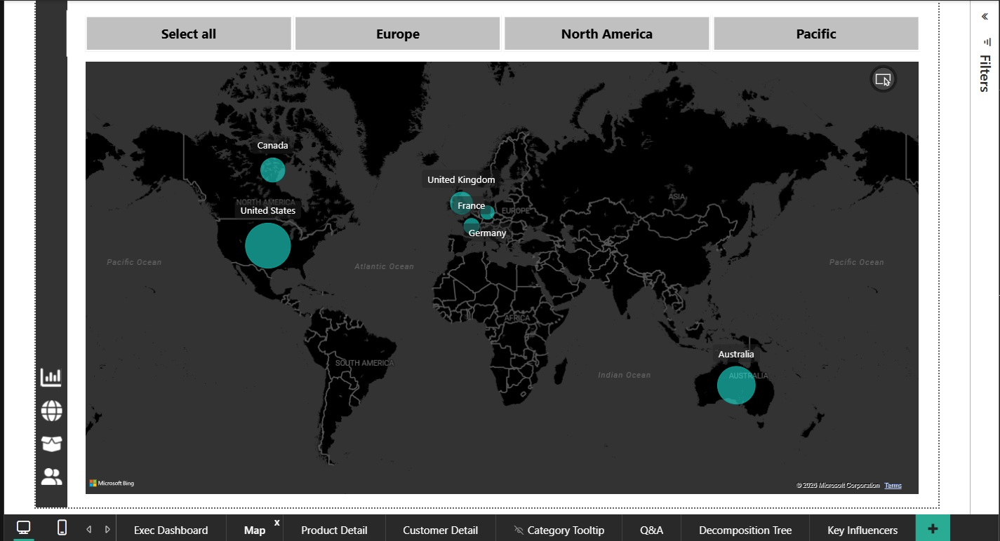
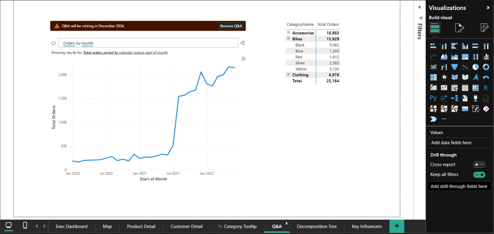
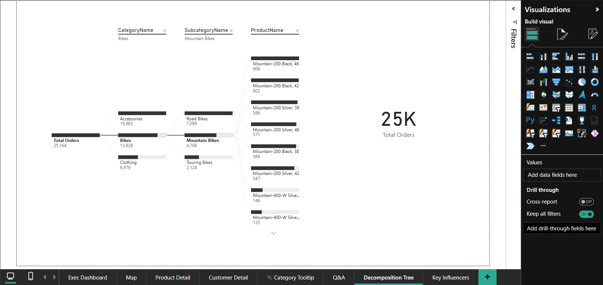
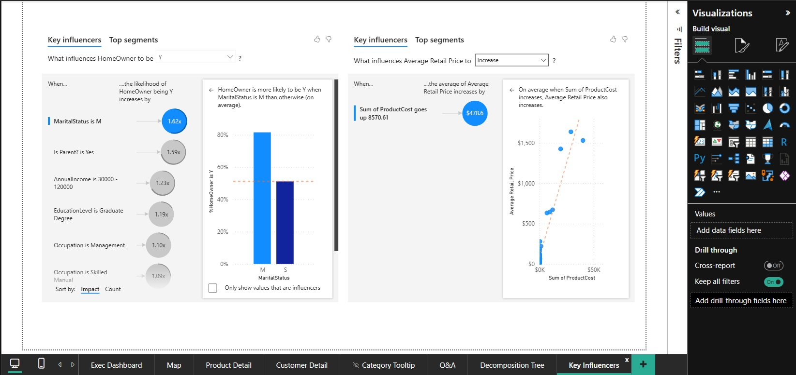

# Power BI Guided Project (Udemy Course)

## About This Project
This is a guided practice project completed as part of a Udemy Power BI course. I followed
instructor-led steps using the course-provided dataset, with a focus on building a wide range
of visualizations, DAX measures, and dashboard design elements within Power BI.

**Note:** My primary projects ([Retail Sales Intelligence Platform](https://github.com/rohitkute2017/retail-sales-platform)
and [HR Attrition Analytics](https://github.com/rohitkute2017/hr-attrition-analytics))
were independently designed and built end-to-end — covering Python-based data pipelines, SQL
data modeling (star schema, medallion architecture), and Row-Level Security, with DAX measures
built to support specific business logic and analysis. This project, by contrast, was
tutorial-based and intentionally broader in scope on the visualization side — practicing a wider
variety of chart types, formatting techniques, and DAX patterns purely within the Power BI
report-building layer, rather than the underlying data architecture.

## What I Practiced
- Power BI report layout and multi-page dashboard design
- DAX measures and calculated fields
- Geographic (map) visuals
- Advanced analytics visuals — Decomposition Tree, Key Influencers
- Natural language Q&A feature
- Visual formatting, tooltips, and interactive elements

## Screenshots

### Executive Dashboard & DAX Measures

### Geographic Map Visual

### Natural Language Q&A

### Decomposition Tree

### Key Influencers

## Tools Used
Power BI Desktop, DAX

## Purpose
Added as supplementary evidence of Power BI visualization and dashboard design practice,
complementing the pipeline and data modeling depth shown in my primary projects.
